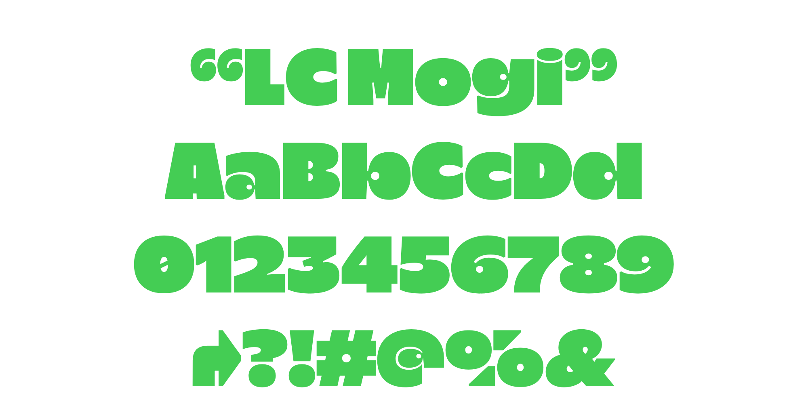

# LC Mogi

LC Mogi Typeface is a playful font with its own strong character and unique charm. Adds an extra touch of playfulness with its distinctive bouncy and chubby letterforms, reminiscent of the plumpness of Bubblegum. It's is suitable for a range of design projects that require a touch of lightheartedness. Whether used in headlines, posters, or branding materials.

LC Mogi adalah font playful dengan karakter yang kuat dan unik. Tambahan sentuhan keceriaan dengan bentuk yang gemuk dan tebal. Terdapat opsi 3 corak lebar yang berbeda. Cocok untuk berbagai proyek desain yang membutuhkan sentuhan keceriaan. Baik berupa judul, poster, atau materi branding.

## Specimen

""

## License

This Font Software is licensed under the SIL Open Font License, Version 1.1.
This license is copied below, and is also available with a FAQ at
http://scripts.sil.org/OFL

## Repository Layout

This font repository structure is inspired by [Unified Font Repository v0.3](https://github.com/unified-font-repository/Unified-Font-Repository).
